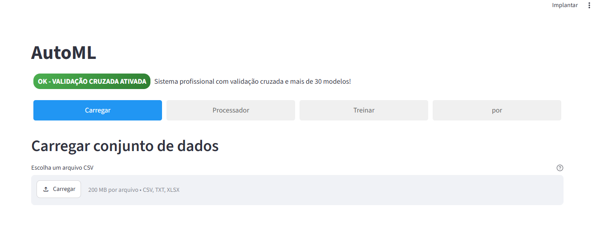
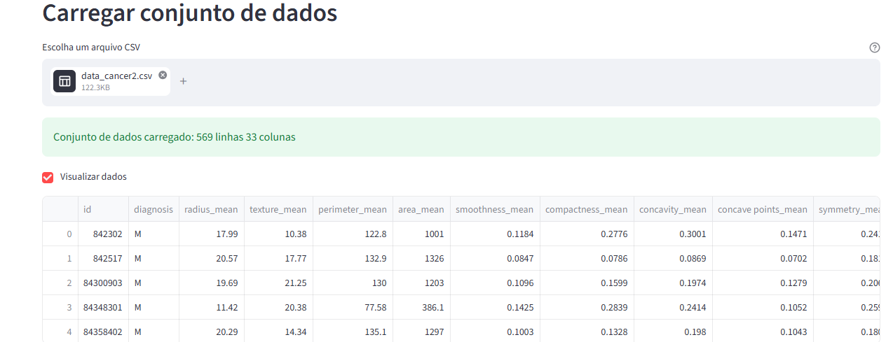
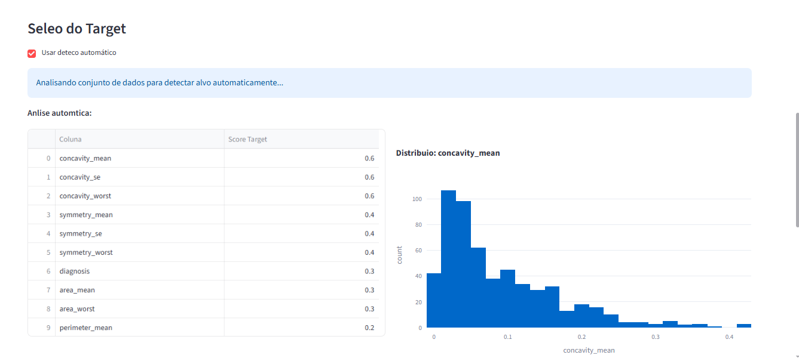
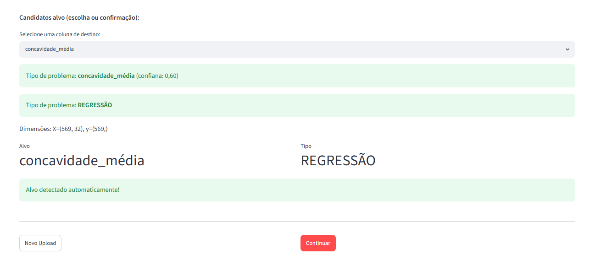
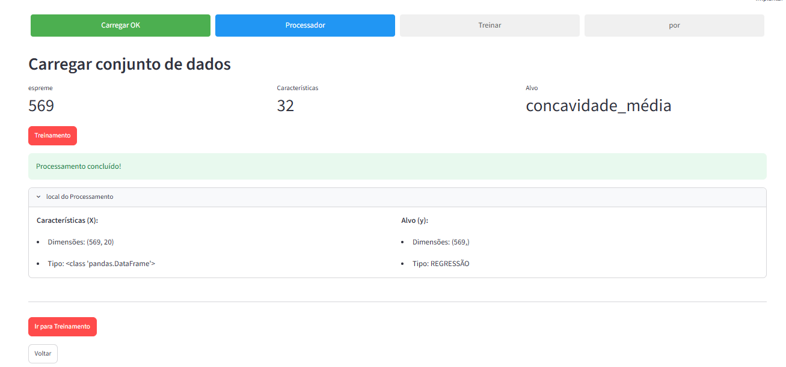
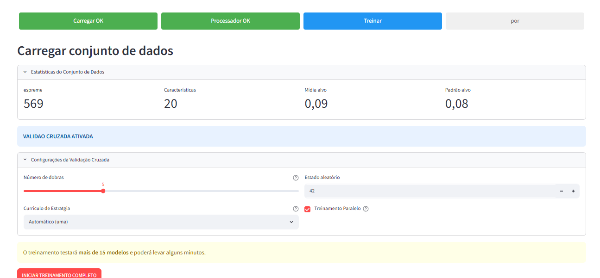
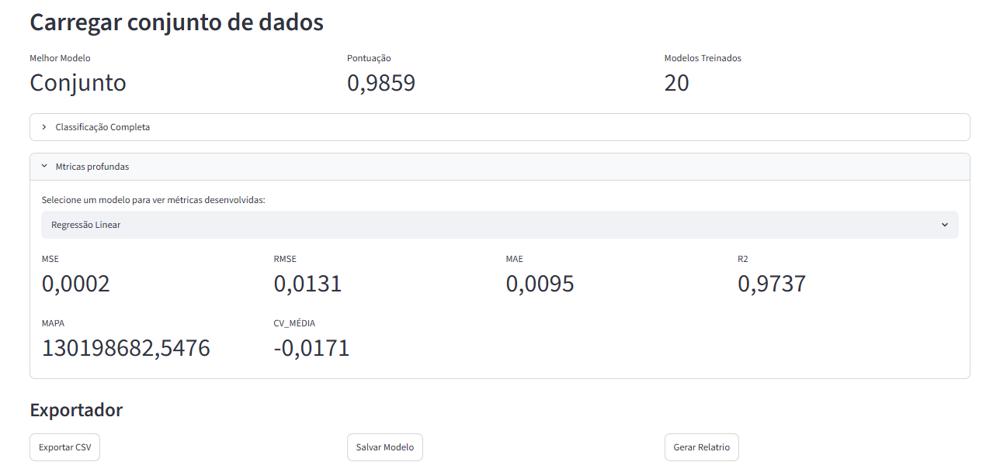
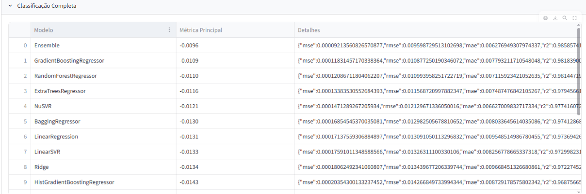

# AutoML

AutoML is a Streamlit-based machine learning application for tabular datasets. It covers the full workflow from dataset upload and target selection to preprocessing, cross-validated model training, ranking, artifact export, and report generation.

This project was built as a portfolio piece with product focus, not just model training. The goal is to show a usable ML interface, modular backend organization, and an end-to-end applied workflow for classification and regression problems.

<p>
  
  
  
  
  
</p>

## Executive Summary

AutoML provides a guided interface for:

- loading CSV, TXT, and Excel datasets
- suggesting or confirming the target column
- preprocessing tabular data for ML training
- running cross-validated experiments across multiple models
- ranking model performance and surfacing the best candidate
- exporting model artifacts, rankings, and PDF/TXT reports

## Portfolio Highlights

| Area | What this project demonstrates |
|---|---|
| Product thinking | Full user flow with clear steps and output artifacts |
| Applied ML | Classification and regression in one interface |
| Engineering | Modular separation between app, processing, training, and reporting |
| Evaluation | Cross-validation, ranking, and model comparison |
| Delivery | Ready-to-show UI with screenshots and exportable outputs |

## Core Capabilities

| Module | Responsibilities |
|---|---|
| `app.py` | Streamlit UI, workflow state, result presentation |
| `data_processing.py` | Cleaning, transformation, encoding, scaling, preparation |
| `model_training.py` | Model training, validation, ranking, ensemble selection |
| `report_generator.py` | Report generation with PDF/TXT fallback |
| `tests/` | Processing, training, and report flow coverage |

## End-to-End Workflow

### 1. Landing and dataset upload

The user starts in a guided Streamlit interface with an explicit step-based workflow and validation-crossed training enabled by default.



### 2. Dataset ingestion and preview

After upload, the application confirms dataset dimensions and allows immediate preview of the raw tabular input.



### 3. Automatic target analysis

The system inspects candidate columns, generates a ranking for likely targets, and visualizes the leading candidate distribution.



### 4. Target confirmation and problem inference

The user can confirm a suggested target or override it manually. The app then infers whether the problem is classification or regression.



### 5. Data processing stage

The processing step summarizes sample size, feature count, selected target, and processed output shapes before training.



### 6. Cross-validation training configuration

The training step exposes folds, CV strategy, random seed, and parallelism controls while keeping the workflow accessible from a single screen.



### 7. Best model summary

Once training finishes, the interface highlights the best model, top score, total models trained, and detailed metric breakdown for any selected model.



### 8. Complete ranking view

The ranking view presents the ordered leaderboard with primary metric and full model details, making comparison and portfolio storytelling straightforward.



## Modeling Scope

### Classification

- Logistic Regression
- Ridge Classifier
- SGD Classifier
- SVC, NuSVC, LinearSVC
- KNeighborsClassifier, RadiusNeighborsClassifier
- DecisionTreeClassifier, ExtraTreeClassifier
- RandomForestClassifier
- GradientBoostingClassifier
- AdaBoostClassifier
- BaggingClassifier
- ExtraTreesClassifier
- HistGradientBoostingClassifier
- GaussianNB, BernoulliNB, MultinomialNB
- LinearDiscriminantAnalysis
- QuadraticDiscriminantAnalysis
- MLPClassifier
- XGBoost, LightGBM, CatBoost when available
- VotingClassifier

### Regression

- LinearRegression
- Ridge, Lasso, ElasticNet
- SGDRegressor
- SVR, NuSVR, LinearSVR
- KNeighborsRegressor, RadiusNeighborsRegressor
- DecisionTreeRegressor, ExtraTreeRegressor
- RandomForestRegressor
- GradientBoostingRegressor
- AdaBoostRegressor
- BaggingRegressor
- ExtraTreesRegressor
- HistGradientBoostingRegressor
- KernelRidge
- MLPRegressor
- XGBoost, LightGBM, CatBoost when available
- VotingRegressor

## Evaluation and Outputs

| Category | Outputs |
|---|---|
| Metrics | Accuracy, F1, Precision, Recall, ROC AUC, R2, RMSE, MAE, Explained Variance |
| Validation | Cross-validation summary and ranking |
| Artifacts | Best model export in `.pkl` |
| Reports | Ranking export in CSV and PDF/TXT report generation |
| Presentation | Visual ranking, summary cards, and detailed metrics |

## Tech Stack

| Layer | Tools |
|---|---|
| Language | Python |
| UI | Streamlit |
| Data | Pandas, NumPy |
| ML | Scikit-learn, XGBoost, LightGBM, CatBoost |
| Optimization | Optuna |
| Visualization | Plotly |
| Serialization | Joblib |
| Reports | ReportLab with TXT fallback |

## Project Structure

```text
AutoML/
|-- app.py
|-- dashboard.py
|-- data_processing.py
|-- model_training.py
|-- report_generator.py
|-- tests/
|-- assets/
|   `-- screenshots/
|-- requirements.txt
`-- README.md
```

## Running Locally

```bash
git clone https://github.com/CostaPaiiva/AutoML.git
cd AutoML
python -m venv .venv
.venv\Scripts\activate
pip install -r requirements.txt
streamlit run app.py
```

- It shows a complete ML product flow rather than isolated notebooks.
- It demonstrates practical model comparison and exportable outputs.
- It combines UI, data engineering, model training, and reporting in one deliverable.
- It is easy for a recruiter or client to understand from screenshots alone.
