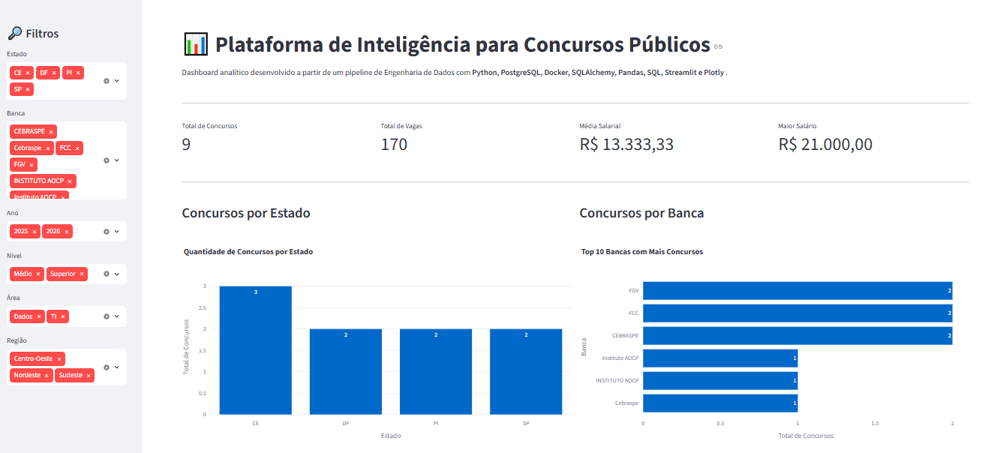
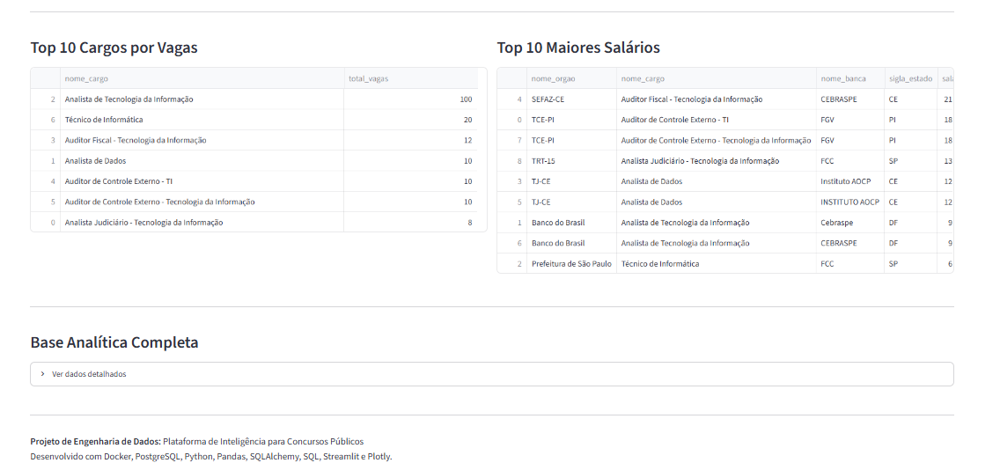
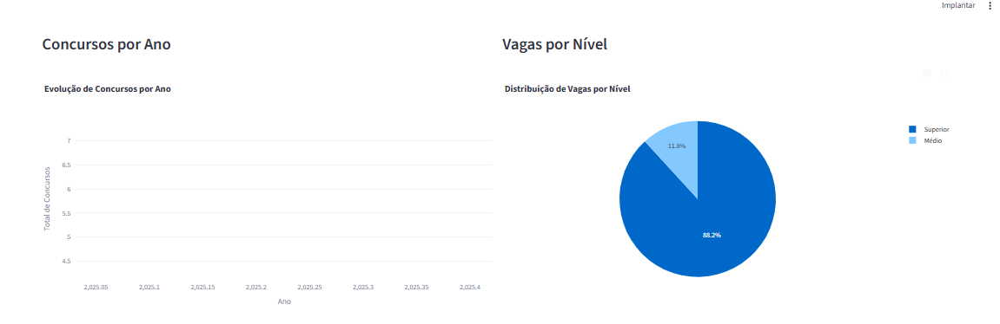
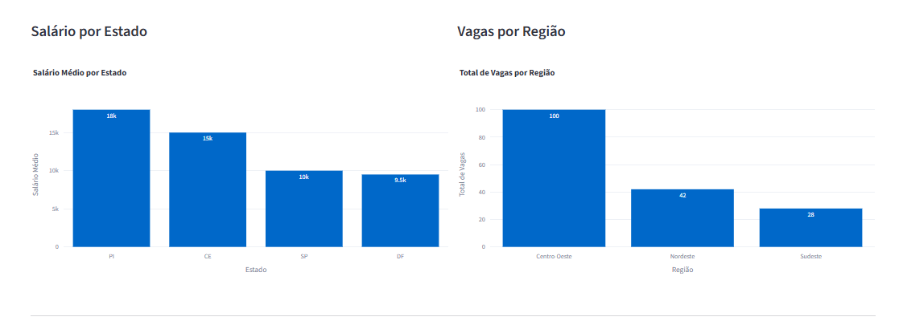
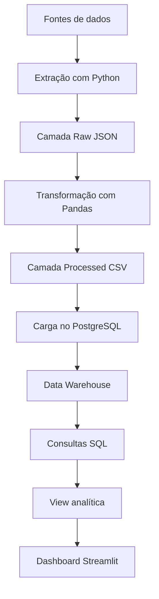

# Plataforma de Inteligência para Concursos Públicos

Projeto de Engenharia de Dados para coletar, tratar, armazenar, analisar e visualizar dados de concursos públicos em um pipeline completo, com foco em vagas de tecnologia e áreas correlatas.

## Sumário
- [Sobre o projeto](#sobre-o-projeto)
- [Demonstração](#demonstração)
- [Problema de negócio](#problema-de-negócio)
- [Objetivos](#objetivos)
- [Arquitetura da solução](#arquitetura-da-solução)
- [Tecnologias utilizadas](#tecnologias-utilizadas)
- [Estrutura do projeto](#estrutura-do-projeto)
- [Modelo de dados](#modelo-de-dados)
- [Pipeline ETL](#pipeline-etl)
- [Consultas analíticas](#consultas-analíticas)
- [Dashboard analítico](#dashboard-analítico)
- [Como executar](#como-executar)
- [Status do projeto](#status-do-projeto)
- [Competências demonstradas](#competências-demonstradas)
- [Próximas melhorias](#próximas-melhorias)
- [Autor](#autor)

## Sobre o projeto

Este projeto simula um fluxo real de dados, desde a geração dos dados brutos até a camada analítica final.

Ele foi desenvolvido para demonstrar domínio em:

- Engenharia de dados
- Modelagem dimensional
- PostgreSQL e SQL
- Pandas e Python
- Streamlit e Plotly
- Docker e Docker Compose

## Demonstração

### Visão geral


### Filtros interativos


### Gráficos e análises


### Análise complementar


## Problema de negócio

As informações sobre concursos públicos estão distribuídas em várias fontes, como:

- Sites de bancas organizadoras
- Portais institucionais
- Portais de notícias
- Editais em PDF
- Diários oficiais
- Agregadores de concursos

Essa dispersão dificulta análises consolidadas, comparação salarial, identificação de bancas recorrentes e acompanhamento regional das oportunidades.

## Objetivos

Construir uma plataforma analítica capaz de responder perguntas como:

| Pergunta analítica | Valor gerado |
|---|---|
| Quais bancas mais organizam concursos de TI? | Direcionamento de estudos |
| Quais estados possuem os melhores salários? | Comparação de oportunidades |
| Quais cargos aparecem com maior frequência? | Identificação de tendências |
| Quais órgãos mais ofertam vagas de tecnologia? | Priorização de editais |
| Como os salários evoluem ao longo dos anos? | Análise histórica |
| Quais concursos possuem maior remuneração? | Apoio à tomada de decisão |
| Quais regiões concentram mais oportunidades? | Análise geográfica |

## Arquitetura da solução



## Tecnologias utilizadas

| Tecnologia | Finalidade |
|---|---|
| Python | Desenvolvimento dos pipelines de dados |
| Pandas | Tratamento e manipulação dos dados |
| PostgreSQL | Data Warehouse analítico |
| SQL | Modelagem, consultas e análises |
| SQLAlchemy | Integração Python com banco |
| psycopg2 | Driver PostgreSQL |
| Docker | Ambiente reprodutível |
| Docker Compose | Orquestração dos containers |
| python-dotenv | Leitura do arquivo `.env` |
| Streamlit | Dashboard interativo |
| Plotly | Visualização de dados |
| Git e GitHub | Versionamento e portfólio |

## Estrutura do projeto

```text
plataforma-inteligencia-concursos/
├── dashboard/
│   ├── app.py
│   ├── dashboard_home.png
│   ├── dashboard_filtros.png
│   ├── dashboard_graficos.png
│   └── dashboard_graficos2.png
├── data/
│   ├── raw/
│   ├── processed/
│   ├── warehouse/
│   └── sample/
├── docs/
│   └── relatorio.md
├── notebooks/
├── src/
│   ├── extraction/
│   ├── transformation/
│   ├── loading/
│   └── database/
├── sql/
│   └── analytics/
├── docker-compose.yml
├── .env.example
├── README.md
└── requirements.txt
```

## Modelo de dados

O projeto usa modelagem dimensional em esquema estrela.

### Tabelas principais

| Tipo | Tabela | Descrição |
|---|---|---|
| Fato | `fato_concurso` | Registra os concursos carregados |
| Dimensão | `dim_banca` | Bancas organizadoras |
| Dimensão | `dim_estado` | Estados e regiões |
| Dimensão | `dim_cargo` | Cargos, áreas e níveis |
| Dimensão | `dim_orgao` | Órgãos públicos e esferas |

### Métricas centrais

| Métrica | Descrição |
|---|---|
| `vagas` | Quantidade de vagas ofertadas |
| `salario` | Salário inicial |
| `ano` | Ano do concurso |
| `data_prova` | Data prevista da prova |

## Pipeline ETL

### Extração

| Item | Descrição |
|---|---|
| Arquivo | `src/extraction/extract_sample_data.py` |
| Entrada | Dados simulados de concursos |
| Saída | JSON em `data/raw/` |

### Transformação

| Item | Descrição |
|---|---|
| Arquivo | `src/transformation/transform_raw_data.py` |
| Entrada | JSON bruto mais recente |
| Saída | CSV tratado em `data/processed/` |

### Carga

| Item | Descrição |
|---|---|
| Arquivo | `src/loading/load_processed_data.py` |
| Entrada | CSV tratado |
| Saída | Tabelas carregadas no PostgreSQL |

### Etapas aplicadas

| Transformação | Descrição |
|---|---|
| Validação de colunas | Confere campos obrigatórios |
| Padronização textual | Remove espaços e normaliza nomes |
| Padronização de cargos | Cria categorias analíticas |
| Padronização de bancas | Normaliza nomes das bancas |
| Conversão de tipos | Ajusta números e datas |
| Faixa salarial | Classifica salários |
| Dias de inscrição | Calcula a duração do período |
| Data de transformação | Registra a execução |

## Consultas analíticas

As consultas ficam em `sql/analytics/`:

| Arquivo | Objetivo |
|---|---|
| `01_kpis_gerais.sql` | Indicadores gerais |
| `02_analise_por_banca.sql` | Análise por banca |
| `03_analise_por_estado.sql` | Análise por estado |
| `04_analise_por_cargo.sql` | Análise por cargo |
| `05_top_salarios.sql` | Top concursos por salário |
| `06_evolucao_por_ano.sql` | Evolução anual |
| `07_visao_completa_concursos.sql` | Visão completa dos concursos |
| `08_create_view_concursos_analytics.sql` | Criação da view analítica |
| `09_kpis_view_analytics.sql` | KPIs usando a view |

## Dashboard analítico

O dashboard foi desenvolvido com Streamlit e Plotly e consome a view `vw_concursos_analytics`.

| Item | Descrição |
|---|---|
| Arquivo | `dashboard/app.py` |
| Fonte de dados | `vw_concursos_analytics` |
| Framework | Streamlit |
| Visualização | Plotly |
| Banco | PostgreSQL |

### Funcionalidades

| Recurso | Descrição |
|---|---|
| KPIs principais | Total de concursos, vagas, média salarial e maior salário |
| Filtros interativos | Estado, banca, ano, nível, área e região |
| Concursos por estado | Gráfico de barras |
| Concursos por banca | Ranking das bancas |
| Concursos por ano | Evolução temporal |
| Vagas por nível | Distribuição por nível |
| Salário médio por estado | Comparação salarial |
| Vagas por região | Distribuição regional |
| Top cargos por vagas | Ranking dos cargos |
| Top salários | Maiores remunerações |
| Base analítica completa | Tabela detalhada |

## Como executar

### 1. Clonar o repositório

```bash
git clone URL_DO_REPOSITORIO
cd plataforma-inteligencia-concursos
```

### 2. Criar o arquivo `.env`

Copie o exemplo:

```bash
cp .env.example .env
```

No Windows CMD:

```cmd
copy .env.example .env
```

Conteúdo esperado:

```env
DB_HOST=localhost
DB_PORT=5432
DB_NAME=concursos_dw
DB_USER=concursos_user
DB_PASSWORD=concursos_pass
```

### 3. Subir os containers

```bash
docker compose up -d
docker compose ps
```

### 4. Instalar dependências

```bash
python -m venv .venv
source .venv/Scripts/activate
pip install -r requirements.txt
```

No PowerShell:

```powershell
.venv\Scripts\Activate.ps1
```

### 5. Executar o ETL

```bash
python src/extraction/extract_sample_data.py
python src/transformation/transform_raw_data.py
python src/loading/load_processed_data.py
```

### 6. Criar a view analítica

```bash
docker exec -i concursos_postgres psql -U concursos_user -d concursos_dw < sql/analytics/08_create_view_concursos_analytics.sql
```

### 7. Executar o dashboard

```bash
streamlit run dashboard/app.py
```

Acesse:

```text
http://localhost:8501
```

## Status do projeto

| Etapa | Status |
|---|---|
| Estrutura inicial | Concluído |
| Ambiente Docker | Concluído |
| Banco PostgreSQL | Concluído |
| pgAdmin | Concluído |
| Modelo dimensional | Concluído |
| Dados de teste | Concluído |
| Conexão Python com PostgreSQL | Concluído |
| Pipeline de extração | Concluído |
| Pipeline de transformação | Concluído |
| Pipeline de carga | Concluído |
| Consultas analíticas SQL | Concluído |
| View analítica | Concluído |
| Dashboard Streamlit | Concluído |
| Relatório técnico | Concluído |

## Competências demonstradas

| Competência | Aplicação |
|---|---|
| Engenharia de Dados | Pipeline completo de ponta a ponta |
| Python | Extração, transformação e carga |
| Pandas | Limpeza e padronização |
| SQL | Consultas analíticas e modelagem |
| PostgreSQL | Data Warehouse relacional |
| Docker | Ambiente local reproduzível |
| SQLAlchemy | Integração entre Python e banco |
| Modelagem Dimensional | Esquema estrela |
| Streamlit | Dashboard interativo |
| Plotly | Gráficos interativos |
| Git e GitHub | Versionamento e portfólio |

## Próximas melhorias

| Melhoria | Descrição |
|---|---|
| Coleta real | Buscar dados em páginas públicas ou APIs |
| Extração de PDF | Ler editais automaticamente |
| Orquestração | Adicionar Airflow ou Prefect |
| Data Lake | Salvar arquivos em Parquet |
| Testes automatizados | Criar validações com pytest |
| Deploy do dashboard | Publicar em ambiente online |
| Qualidade de dados | Adicionar checks de consistência |
| CI/CD | Automatizar validações no GitHub Actions |

## Autor

Projeto desenvolvido como parte de um portfólio profissional de Engenharia de Dados, com foco em dados, automação e visualização analítica.
