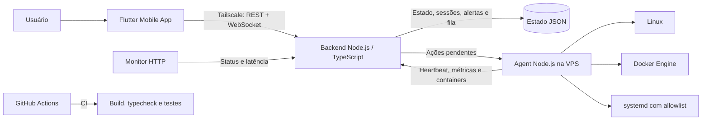

# VPS Controller

<p align="center">
  <strong>Monitoramento e administração controlada de uma VPS Linux, a partir de um aplicativo Flutter.</strong>
</p>

<p align="center">
  Flutter · Dart · Node.js · TypeScript · Docker · systemd · WebSocket · GitHub Actions
</p>

<p align="center">
  <a href="#arquitetura">Arquitetura</a> ·
  <a href="#segurança">Segurança</a> ·
  <a href="#desenvolvimento">Desenvolvimento</a> ·
  <a href="#ci">CI</a>
</p>

[](https://flutter.dev/)
[](https://nodejs.org/)
[](https://www.typescriptlang.org/)
[](https://www.docker.com/)
[](.github/workflows/ci.yml)

## Visão geral

O VPS Controller é uma plataforma privada para acompanhar o estado de uma VPS Linux e executar ações operacionais previsíveis, por uma interface mobile.

Em vez de expor um terminal remoto, o projeto usa uma arquitetura com responsabilidades separadas: o aplicativo apresenta os dados, o Backend concentra autenticação e estado, e o Agent instalado na VPS coleta informações e executa apenas operações autorizadas.

### O que o projeto entrega

| Área | Recursos implementados |
| --- | --- |
| Observabilidade | CPU, RAM, discos, uptime, carga do sistema, interfaces de rede, hostname, SO, kernel e arquitetura |
| Infraestrutura | Descoberta de containers Docker, status e informações disponíveis por container |
| Operação | `start`, `stop` e `restart` para Docker; ações systemd sujeitas a allowlist |
| Disponibilidade | Heartbeat do Agent, monitor HTTP externo, alertas, cooldown e deduplicação |
| Aplicativo | Login, dashboard, Docker, Sistema, Alertas, Ajustes e Manual do Usuário offline |
| Comunicação | REST para operações e WebSocket para eventos do Backend |

> O projeto não oferece shell arbitrário e não executa comandos enviados livremente pela interface.

## Arquitetura



| Componente | Responsabilidade |
| --- | --- |
| `mobile/` | Interface Flutter, sessão segura, dashboard e ações controladas |
| `backend/` | API, autenticação, estado, alertas, WebSocket e fila de ações |
| `agent/` | Coleta de métricas, Docker, systemd e execução de ações permitidas |
| `monitor/` | Verificação periódica de targets HTTP e reporte de disponibilidade |
| `docker/` | Arquivos de apoio para execução e unit do Agent |

## Fluxo operacional

```text
Usuário
  ↓ login com usuário e senha
Aplicativo Flutter
  ↓ token de sessão
Backend
  ├── consulta o estado atual da VPS
  ├── recebe métricas e heartbeat do Agent
  ├── recebe disponibilidade do Monitor
  └── mantém ações pendentes
       ↓
Agent na VPS
  ├── Linux: CPU, RAM, disco, uptime e rede
  ├── Docker: containers e ações permitidas
  └── systemd: serviços presentes na allowlist
```

O aplicativo não acessa Docker ou systemd diretamente. As operações passam pelo Backend, entram na fila e são executadas pelo Agent na VPS.

## Rede privada com Tailscale

Na implantação privada recomendada, o Tailscale é usado para criar a rede segura entre o celular e a VPS. É por essa rede que o aplicativo consegue alcançar as URLs configuradas em `API_BASE_URL` e `WS_URL`.

```text
Celular com Tailscale conectado
        ↓ rede privada
VPS com Tailscale conectado
        ↓
Backend do VPS Controller
```

Isso evita a necessidade de publicar o painel administrativo diretamente na internet. Para usar o aplicativo nessa arquitetura, o Tailscale precisa estar conectado no celular e na VPS, e ambos devem pertencer à mesma rede privada (tailnet) ou ter acesso autorizado entre si.

O Flutter não depende tecnicamente do Tailscale: ele usa as URLs definidas na instalação. Portanto, em desenvolvimento local é possível usar um emulador e um endereço local; já em produção privada, o Tailscale é a forma recomendada de fornecer conectividade protegida.

### Quando o aplicativo não conecta

Antes de investigar o Backend, confirme:

1. O celular tem acesso à internet.
2. O Tailscale está conectado no celular.
3. O Tailscale está ativo na VPS.
4. As URLs `API_BASE_URL` e `WS_URL` apontam para o endereço privado correto da VPS.
5. O Backend está em execução e responde ao endpoint `/health`.

O aplicativo não configura nem inicia o Tailscale; ele apenas usa a conectividade privada já estabelecida.

## Segurança

### Autenticação humana

O login do aplicativo usa usuário e senha. A senha é enviada apenas para `POST /auth/login` e o Backend:

1. valida o usuário configurado;
2. verifica a senha contra um hash `scrypt` armazenado no servidor;
3. cria uma sessão assinada com HMAC-SHA256;
4. aplica expiração configurável à sessão;
5. retorna ao aplicativo somente o token de sessão e seu prazo.

O Flutter persiste somente o token em `flutter_secure_storage`. A senha não é armazenada pelo aplicativo e o logout remove a sessão local.

### Credenciais separadas por responsabilidade

| Credencial | Uso |
| --- | --- |
| Sessão do usuário | Rotas da API usadas pelo aplicativo e WebSocket |
| `AGENT_TOKEN` | Heartbeat, métricas, containers e ações do Agent |
| `MONITOR_TOKEN` | Reportes de disponibilidade enviados pelo Monitor |

### Ações permitidas

```text
docker.start       docker.stop       docker.restart
service.start      service.stop      service.restart
```

O Backend aceita apenas os tipos listados. O Agent valida o alvo Docker e impede ações systemd fora de `ALLOWED_SERVICES`.

> Docker Socket equivale a privilégio elevado no host. Em produção, o Agent deve rodar com o menor conjunto possível de permissões e regras `sudoers` específicas quando necessárias.

## Aplicativo Flutter

O aplicativo foi pensado para uso operacional rápido em uma VPS principal:

- **Início:** status de Agent e Monitor, último heartbeat, CPU, RAM, disco, uptime, rede, containers, alertas e indicadores de atenção.
- **Docker:** visão consolidada dos containers, status, portas e métricas disponíveis, com confirmação para parar ou reiniciar.
- **Sistema:** inventário do host, carga, todos os volumes reportados e interfaces de rede.
- **Alertas:** avisos retornados pelo Backend, com severidade e estado.
- **Ajustes:** endpoints configurados, sessão local, informações do app e logout.
- **Manual do Usuário:** conteúdo local pesquisável, disponível mesmo sem conexão com a VPS.

Para iniciar o app em desenvolvimento:

```bash
cd mobile
flutter pub get
flutter analyze
flutter test

flutter run \
  --dart-define=API_BASE_URL=http://ENDERECO_PRIVADO_DA_VPS:PORTA \
  --dart-define=WS_URL=ws://ENDERECO_PRIVADO_DA_VPS:PORTA/ws
```

Não inclua usuário, senha ou token de sessão em `dart-define` ou no código-fonte.

Em produção privada, substitua `ENDERECO_PRIVADO_DA_VPS` pelo endereço acessível via Tailscale. Não publique esse endereço em repositórios ou capturas de tela.

## Backend

O Backend concentra a API e o estado operacional. Ele expõe health check, login, leitura de servidores, histórico, alertas, fila de ações, endpoints internos para Agent/Monitor e WebSocket.

O estado é persistido em arquivo JSON configurável por `DATA_FILE`.

```bash
cd backend
npm ci
npm run typecheck
npm test
npm run build
npm start
```

Durante o desenvolvimento:

```bash
npm run dev
curl http://localhost:3000/health
```

## Agent

O Agent roda dentro da VPS e executa ciclos independentes e configuráveis para:

- heartbeat;
- métricas do Linux;
- descoberta de containers;
- consulta e retorno de ações.

As frequências são definidas por `HEARTBEAT_INTERVAL_MS`, `METRICS_INTERVAL_MS`, `CONTAINERS_INTERVAL_MS` e `ACTIONS_INTERVAL_MS`.

```bash
cd agent
npm ci
npm run typecheck
npm run build
npm start
```

Há uma unit de referência em `docker/vps-controller-agent.service` para adaptação a systemd.

## Monitor

O Monitor verifica URLs configuradas em `MONITOR_TARGETS_JSON`, mede a latência e informa o resultado ao Backend com `MONITOR_TOKEN`.

```bash
cd monitor
npm ci
npm run typecheck
npm run build
npm start
```

## Configuração

Crie arquivos locais a partir dos exemplos, sem versionar seus valores reais:

```bash
cp backend/.env.example backend/.env
cp agent/.env.example agent/.env
cp monitor/.env.example monitor/.env
```

### Backend

```env
HOST=0.0.0.0
PORT=3000
DATA_FILE=./data/state.json

ADMIN_USERNAME=admin
ADMIN_PASSWORD_HASH=<hash-scrypt>
JWT_SECRET=<segredo-aleatorio>
SESSION_TTL_SECONDS=86400

AGENT_TOKEN=<segredo-do-agent>
MONITOR_TOKEN=<segredo-do-monitor>

ALERT_CPU_PERCENT=90
ALERT_RAM_PERCENT=90
ALERT_DISK_PERCENT=90
AGENT_STALE_SECONDS=60
```

### Agent e Monitor

Consulte os arquivos [agent/.env.example](agent/.env.example) e [monitor/.env.example](monitor/.env.example). Eles documentam, respectivamente, a URL do Backend, identidade do servidor, allowlist, intervalos e targets de monitoramento.

## Desenvolvimento

O repositório inclui scripts de preparação para os componentes Node:

```powershell
./scripts/setup.ps1
```

```bash
./scripts/setup.sh
```

Também é possível executar Backend e Monitor em containers para desenvolvimento:

```bash
docker compose up --build
```

O Agent não é iniciado pelo Compose: ele é destinado à execução dentro da VPS monitorada.

## Testes

| Projeto | Verificações disponíveis |
| --- | --- |
| Backend | Build, typecheck e testes de senha, sessão, persistência, heartbeat, métricas e ações |
| Agent | Build e typecheck; há script de teste, sem suíte funcional versionada no momento |
| Monitor | Build e typecheck |
| Mobile | Análise e testes Flutter |

Comandos principais:

```bash
# Backend
cd backend && npm test

# Agent
cd agent && npm run typecheck && npm run build

# Monitor
cd monitor && npm run typecheck && npm run build

# Mobile
cd mobile && flutter analyze && flutter test
```

## CI

O workflow [CI](.github/workflows/ci.yml) roda em todo `push` e `pull_request` para `backend`, `agent` e `monitor`:

```text
checkout → Node.js 22 → npm install → typecheck → testes quando disponíveis
```

O repositório não possui workflow de deploy automático via SSH. A atualização de produção deve ser realizada com revisão, backup e procedimentos adequados ao ambiente.

## Estrutura do repositório

```text
VPS-Controller/
├── .github/workflows/      # Integração contínua
├── agent/                  # Processo residente na VPS
├── backend/                # API, auth, alertas e estado
├── docker/                 # Unit e arquivos de apoio
├── docs/                   # Arquitetura, segurança e setup
├── mobile/                 # Aplicativo Flutter
├── monitor/                # Monitor HTTP externo
├── scripts/                # Automação de setup local
├── docker-compose.yml      # Backend e Monitor para desenvolvimento
└── README.md
```

## Screenshots

<!-- Adicionar screenshot do Login aqui -->

<!-- Adicionar screenshot do Dashboard aqui -->

<!-- Adicionar screenshot do Docker aqui -->

<!-- Adicionar screenshot do Sistema aqui -->

<!-- Adicionar screenshot dos Alertas aqui -->

## Decisões técnicas

- Separação explícita entre sessão humana, Agent e Monitor.
- Sem dependências de runtime nos componentes Node para o núcleo de monitoramento.
- Fila de ações entre Backend e Agent, em vez de execução direta pelo aplicativo.
- Allowlists para limitar operações administrativas.
- Persistência simples de estado para o estágio atual do projeto.
- Interface mobile preparada para operar mesmo quando a API estiver indisponível.

## Roadmap

Itens planejados, ainda não implementados:

- histórico avançado e gráficos de métricas;
- suporte completo a múltiplos servidores no aplicativo;
- notificações push;
- RBAC e autenticação multifator;
- logs centralizados e observabilidade;
- rollback automático e releases versionadas.

## Status

Em desenvolvimento ativo. O projeto possui CI para os componentes Node e deve ser validado no ambiente Linux antes de qualquer instalação de produção.

## Autor

Desenvolvido por Costa Paiva.
