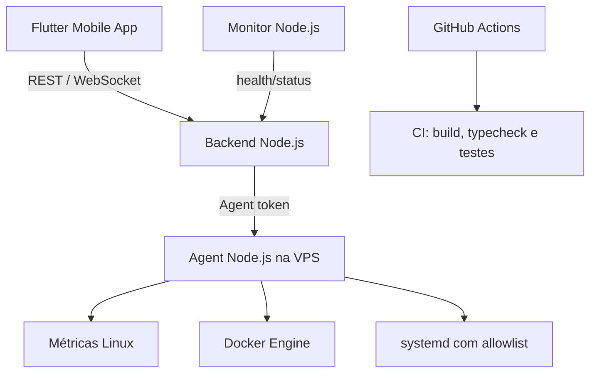

# VPS Controller

Plataforma privada para monitoramento e gerenciamento controlado de uma VPS Linux, com aplicativo Flutter, Backend Node.js/TypeScript, Agent executado no servidor e Monitor externo.

[](https://flutter.dev/)
[](https://nodejs.org/)
[](https://www.typescriptlang.org/)
[](https://github.com/features/actions)

## Visão geral

O VPS Controller centraliza, em um aplicativo Android, o acompanhamento do estado de uma VPS e a execução de ações administrativas previamente permitidas.

O sistema reúne:

- métricas de CPU, memória, disco, uptime e rede;
- hostname, sistema operacional, kernel e arquitetura;
- descoberta e status de containers Docker;
- ações Docker `start`, `stop` e `restart`;
- ações systemd sujeitas a allowlist;
- heartbeat do Agent;
- monitoramento externo de disponibilidade;
- alertas com cooldown e deduplicação;
- atualização por REST e WebSocket;
- manual de usuário offline no aplicativo.

O projeto não oferece shell remoto nem execução arbitrária de comandos.

## Arquitetura



### Mobile

Aplicativo Flutter para autenticação, dashboard, sistema, Docker, alertas, ajustes e manual offline. A interface utiliza os dados recebidos pela API e não executa Docker ou comandos Linux diretamente.

### Backend

API Node.js/TypeScript responsável por autenticação do usuário, sessões, estado dos servidores, métricas, alertas, fila de ações, health check e WebSocket.

O estado atual é persistido em arquivo JSON configurável por `DATA_FILE`.

### Agent

Processo Node.js executado diretamente na VPS. Envia heartbeat, coleta métricas, descobre containers, consulta ações pendentes e executa somente operações Docker e systemd autorizadas.

### Monitor

Processo Node.js independente que verifica targets HTTP periodicamente e informa ao Backend se o endpoint está online ou offline.

### GitHub Actions

O workflow `.github/workflows/ci.yml` executa CI para `backend`, `agent` e `monitor` em pushes e pull requests. Atualmente ele instala dependências, executa typecheck e testes quando disponíveis. Não há workflow de deploy automático via SSH neste repositório.

## Fluxo da aplicação

```text
Usuário
   ↓
Aplicativo Flutter
   ↓ usuário/senha
POST /auth/login
   ↓ token de sessão
Backend
   ↓ estado, métricas e ações
Agent
   ↓
Linux / Docker / systemd
```

O Agent mantém comunicação própria com o Backend usando `AGENT_TOKEN`. O Monitor usa `MONITOR_TOKEN`. Essas credenciais internas são distintas da sessão do usuário do aplicativo.

## Segurança

### Autenticação do aplicativo

O aplicativo envia usuário e senha para `POST /auth/login`. O Backend:

1. compara o usuário configurado;
2. verifica a senha contra um hash `scrypt` armazenado no servidor;
3. gera um token de sessão assinado com HMAC-SHA256;
4. inclui expiração no token;
5. retorna somente o token e seu tempo de validade.

O Flutter armazena apenas o token de sessão usando `flutter_secure_storage`. A senha não é persistida pelo aplicativo. O logout remove o token salvo.

### Autenticação interna

- `AGENT_TOKEN`: autentica heartbeat, métricas, containers e ações do Agent.
- `MONITOR_TOKEN`: autentica os reports do Monitor.
- Sessão do usuário: autentica as rotas REST do aplicativo e o WebSocket.

As variáveis devem ser mantidas em `.env` fora do Git. Nunca publique senhas, hashes, tokens, `JWT_SECRET`, chaves SSH ou IPs privados da infraestrutura.

### Ações controladas

O Backend aceita apenas:

```text
docker.start
docker.stop
docker.restart
service.start
service.stop
service.restart
```

O Agent valida a família da ação, o alvo Docker e a allowlist de serviços systemd. Não existe endpoint de shell arbitrário.

O acesso ao Docker Socket concede privilégios elevados no host; por isso, o usuário e as permissões do Agent devem ser restritos na VPS.

## Tecnologias

| Tecnologia | Finalidade |
| --- | --- |
| Flutter / Dart | Aplicativo mobile |
| Node.js | Backend, Agent e Monitor |
| TypeScript | Código dos componentes Node |
| HTTP REST | API e comunicação com Agent/Monitor |
| WebSocket | Eventos em tempo real |
| scrypt | Hash seguro de senha |
| HMAC-SHA256 | Assinatura do token de sessão |
| Docker | Containers administrados pelo Agent |
| systemd | Serviços Linux sujeitos a allowlist |
| GitHub Actions | Integração contínua |
| JSON | Persistência local do estado do Backend |

## Estrutura do projeto

```text
VPS-Controller/
├── agent/                  # Agent executado na VPS
├── backend/                # API e estado da plataforma
├── docker/                 # Service unit e configuração relacionada
├── docs/                   # Arquitetura, setup, segurança e validações
├── mobile/                 # Aplicativo Flutter
├── monitor/                # Monitor externo HTTP
├── scripts/                # Scripts de preparação local
├── .github/workflows/      # CI do projeto Node
├── docker-compose.yml      # Backend e Monitor em desenvolvimento
└── README.md
```

## Backend

O Backend expõe health check, autenticação, servidores, histórico, alertas, ações e endpoints internos para Agent e Monitor.

Comandos disponíveis:

```bash
cd backend
npm ci
npm run typecheck
npm test
npm run build
npm start
```

Durante desenvolvimento:

```bash
npm run dev
```

Health check:

```bash
curl http://localhost:3000/health
```

## Agent

O Agent usa intervalos configuráveis para executar as tarefas:

- heartbeat;
- métricas;
- descoberta de containers;
- consulta de ações.

Os intervalos são definidos por `HEARTBEAT_INTERVAL_MS`, `METRICS_INTERVAL_MS`, `CONTAINERS_INTERVAL_MS` e `ACTIONS_INTERVAL_MS`.

Comandos:

```bash
cd agent
npm ci
npm run typecheck
npm run build
npm start
```

Em produção, o arquivo `docker/vps-controller-agent.service` pode ser adaptado para execução via systemd. O projeto não inclui um workflow de instalação automática da VPS.

## Aplicativo Flutter

Telas atuais:

- Login com usuário e senha;
- Início/dashboard da VPS principal;
- Docker;
- Sistema;
- Alertas;
- Ajustes;
- Manual do Usuário offline.

O dashboard apresenta CPU, RAM, capacidade utilizada do disco, uptime, rede, containers e alertas quando esses dados estiverem disponíveis na API.

Comandos de desenvolvimento:

```bash
cd mobile
flutter pub get
flutter analyze
flutter test
flutter run \
  --dart-define=API_BASE_URL=http://SEU_SERVIDOR:PORTA \
  --dart-define=WS_URL=ws://SEU_SERVIDOR:PORTA/ws
```

O usuário não deve ser colocado em `dart-define` nem no código-fonte.

## Monitor

O Monitor recebe targets por `MONITOR_TARGETS_JSON`, verifica cada URL a partir de `CHECK_INTERVAL_MS` e reporta status e latência ao Backend.

```bash
cd monitor
npm ci
npm run typecheck
npm run build
npm start
```

## Configuração

Copie os exemplos e preencha valores somente no ambiente local ou na VPS:

```bash
cp backend/.env.example backend/.env
cp agent/.env.example agent/.env
cp monitor/.env.example monitor/.env
```

### Backend

```env
HOST=0.0.0.0
PORT=3000
DATA_FILE=./data/state.json
ADMIN_USERNAME=admin
ADMIN_PASSWORD_HASH=<hash-scrypt-gerado-fora-do-repositorio>
JWT_SECRET=<segredo-aleatorio>
SESSION_TTL_SECONDS=86400
AGENT_TOKEN=<token-do-agent>
MONITOR_TOKEN=<token-do-monitor>
ALERT_CPU_PERCENT=90
ALERT_RAM_PERCENT=90
ALERT_DISK_PERCENT=90
AGENT_STALE_SECONDS=60
```

### Agent

As variáveis principais são `BACKEND_URL`, `SERVER_ID`, `AGENT_ID`, `AGENT_VERSION`, `AGENT_TOKEN`, `ALLOWED_SERVICES`, `SYSTEMD_USE_SUDO` e os intervalos de execução. Consulte `agent/.env.example`.

### Monitor

As variáveis principais são `BACKEND_URL`, `MONITOR_TOKEN`, `CHECK_INTERVAL_MS` e `MONITOR_TARGETS_JSON`. Consulte `monitor/.env.example`.

## Testes e CI

Backend:

```bash
cd backend
npm test
```

Os testes atuais cobrem hash/verificação de senha, assinatura/verificação de sessão e persistência de heartbeat, métricas e ações.

Agent e Monitor possuem scripts de build e typecheck. O Agent possui script de teste, mas não há uma suíte funcional equivalente à do Backend no momento. O Monitor não declara script de teste.

No GitHub Actions, o workflow de CI executa `npm install`, `npm run typecheck` e `npm test --if-present` para os três projetos Node.

## Execução em produção

Uma instalação Linux pode manter os processos como serviços:

```text
systemd
└── vps-controller-agent
```

O Backend também pode ser executado como serviço systemd conforme a configuração operacional da VPS, mas não há uma unit de Backend versionada neste repositório. Ajuste usuário, diretórios, variáveis e permissões antes de instalar.

O deploy não é automático por este repositório. Para atualizar a VPS, faça revisão, backup e execução manual dos comandos adequados ao ambiente de produção.

## Docker Compose

`docker-compose.yml` define containers de desenvolvimento para Backend e Monitor, com volume persistente para o estado do Backend. O Agent não é iniciado por esse Compose; ele é destinado à execução na VPS.

```bash
docker compose up --build
```

Não execute ações administrativas em containers de produção sem confirmar o alvo e o impacto.

## Screenshots

<!-- Adicionar screenshot do Login aqui -->

<!-- Adicionar screenshot do Dashboard aqui -->

<!-- Adicionar screenshot do Docker aqui -->

<!-- Adicionar screenshot do Sistema aqui -->

<!-- Adicionar screenshot dos Alertas aqui -->

<!-- Adicionar screenshot do GitHub Actions aqui -->

## Desafios técnicos

- Separar autenticação humana da autenticação interna do Agent e Monitor.
- Persistir estado de monitoramento sem introduzir dependências de runtime desnecessárias.
- Coletar métricas Linux e tratar indisponibilidade de Docker/systemd.
- Restringir ações administrativas a operações e serviços autorizados.
- Manter o fluxo de ações assíncrono entre aplicativo, Backend e Agent.
- Detectar offline, gerar alertas e aplicar cooldown para evitar duplicação contínua.
- Manter a interface funcional quando a API ou a VPS estiverem indisponíveis.

## Roadmap

Itens abaixo são possibilidades futuras e não fazem parte da implementação atual:

- rollback automático de deploy;
- cobertura funcional mais ampla;
- histórico avançado de métricas;
- suporte completo a múltiplos servidores no aplicativo;
- notificações push;
- RBAC e autenticação multifator;
- observabilidade e logs centralizados;
- releases versionadas.

## Status

Projeto em desenvolvimento ativo. O núcleo Node, o fluxo Agent/Backend, o aplicativo Flutter e a integração controlada com Docker/systemd continuam sujeitos a validação no ambiente Linux de produção.

## Autor

Desenvolvido por Costa Paiva.
