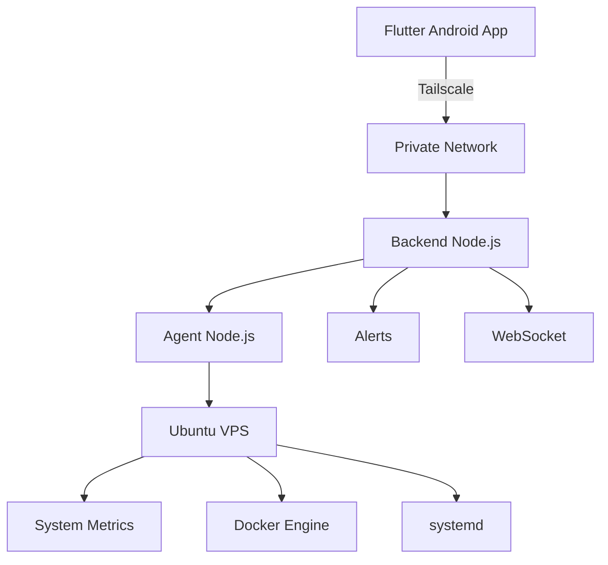

# VPS Controller — Server Management

Painel privado para monitoramento e gerenciamento remoto de servidores Linux através de Flutter, Node.js, Docker, systemd e Tailscale.

## Sobre

O VPS Controller centraliza no celular o monitoramento e o controle de uma VPS privada. O aplicativo Flutter conversa com o backend Node.js pela rede Tailscale; o Agent instalado na VPS coleta métricas e executa somente ações explicitamente permitidas.

Princípios:
- segurança e baixo consumo de recursos;
- comunicação privada, sem painel web público obrigatório;
- ausência de shell ou execução arbitrária de comandos;
- ações protegidas por allowlist.

## Arquitetura



```text
Android App → Tailscale → Backend API → VPS Controller Agent
                                      ├─ métricas Linux
                                      ├─ Docker
                                      └─ systemd allowlist
```

## Componentes

- `mobile/`: aplicativo Flutter para autenticação, dashboard, métricas, containers, ações, alertas e atualizações em tempo real.
- `backend/`: API Node.js + TypeScript, estado da VPS, métricas, fila de ações, alertas e WebSocket.
- `agent/`: serviço instalado na VPS para métricas Linux, Docker, heartbeat e systemd autorizado.
- `monitor/`: monitor externo de disponibilidade HTTP/HTTPS.

## Monitoramento

O Agent fornece hostname, sistema operacional, kernel, arquitetura, CPU, RAM, discos, uptime, interfaces de rede, status e última comunicação.

Containers são obtidos dinamicamente da API e podem usar as ações:

```text
docker.start
docker.stop
docker.restart
```

Serviços systemd aceitam somente:

```text
service.start
service.stop
service.restart
```

Alertas incluem CPU, RAM, disco, Agent offline, servidor offline e containers parados, com cooldown e deduplicação.

## Segurança

```text
App não executa shell
        ↓
Backend aceita apenas ações conhecidas
        ↓
Agent valida a ação
        ↓
Allowlist valida o recurso
        ↓
Docker/systemd executam a operação autorizada
```

Não existem endpoints para `bash`, `sh`, `exec`, `shell` ou comandos arbitrários. Nunca use `NOPASSWD: ALL`; configure sudoers somente para os serviços necessários.

Tokens reais, chaves, certificados e arquivos `.env` nunca devem ser commitados. O WebSocket usa o token de usuário em desenvolvimento:

```text
/ws?token=USER_TOKEN
```

Tokens nunca devem aparecer em logs, erros ou mensagens do aplicativo.

## Tailscale

O backend pode permanecer restrito ao localhost da VPS:

```text
Android → Tailscale IP:8080 → 127.0.0.1:3100
```

As URLs do aplicativo são fornecidas por `dart-define`, sem incluir tokens no APK:

```bash
flutter run \
  --dart-define=API_BASE_URL=http://TAILSCALE_IP:PORT \
  --dart-define=WS_URL=ws://TAILSCALE_IP:PORT/ws
```

## Estrutura

```text
VPS-Controller/
├── mobile/       # Flutter
├── backend/      # API Node.js/TypeScript
├── agent/        # Agent instalado na VPS
├── monitor/      # Monitor externo
├── docker/       # Templates de deploy e serviços
└── docs/         # Arquitetura, setup e segurança
```

## Backend

```bash
cd backend
npm install
npm run typecheck
npm test
npm run build
npm start
```

Configure `backend/.env` a partir de `.env.example` com `HOST`, `PORT`, `DATA_FILE`, `USER_TOKEN`, `AGENT_TOKEN`, `MONITOR_TOKEN`, thresholds e `AGENT_STALE_SECONDS`.

Health check:

```bash
curl http://127.0.0.1:3100/health
```

Resposta esperada:

```json
{"status":"ok","version":"0.2.0"}
```

## Agent

```bash
cd agent
npm install
npm run typecheck
npm run build
npm start
```

Configure `agent/.env` com `BACKEND_URL`, `SERVER_ID`, `AGENT_ID`, `AGENT_TOKEN`, `AGENT_VERSION`, `ALLOWED_SERVICES` e `SYSTEMD_USE_SUDO`.

## Monitor

```bash
cd monitor
npm install
npm run typecheck
npm run build
npm start
```

Configure `monitor/.env` com `BACKEND_URL`, `MONITOR_TOKEN`, timeouts e `MONITOR_TARGETS_JSON`.

## Flutter e APK

```bash
cd mobile
flutter pub get
flutter analyze
flutter test
```

Debug Android:

```bash
flutter build apk --debug \
  --dart-define=API_BASE_URL=http://TAILSCALE_IP:PORT \
  --dart-define=WS_URL=ws://TAILSCALE_IP:PORT/ws
```

O APK é gerado em `mobile/build/app/outputs/app-debug.apk`. O token é informado no login e armazenado com segurança pelo aplicativo; não deve ser passado no comando de build.

## systemd

Execute backend e Agent com usuários dedicados e privilégios mínimos. Para systemd, use sudoers restrito aos serviços autorizados; nunca conceda `NOPASSWD: ALL`.

```bash
sudo systemctl daemon-reload
sudo systemctl enable --now vps-controller-agent
```

## Docker Compose

```bash
docker compose build
docker compose up -d
```

Não exponha o Docker socket sem compreender que ele equivale a privilégio elevado no host.

## Validação

```bash
dart format lib test
flutter analyze
flutter test
```

Nos módulos Node:

```bash
npm run typecheck
npm test
npm run build
```

Teste ações administrativas somente em recursos descartáveis. Não execute stop/restart em containers importantes durante validações.

## Estado atual

O núcleo suporta backend, Agent, heartbeat, métricas, Docker discovery e ações, systemd allowlist, alertas, WebSocket, monitor externo, Android e conectividade privada Tailscale.

PostgreSQL, Redis, backups, logs Docker, gráficos históricos, notificações push e auditoria detalhada exigem integrações específicas e devem ser implementados sem introduzir shell arbitrário ou reduzir as restrições de segurança.

## Privacidade

O VPS Controller é uma ferramenta privada/self-hosted:

```text
Seu celular → sua rede Tailscale → sua VPS
```

