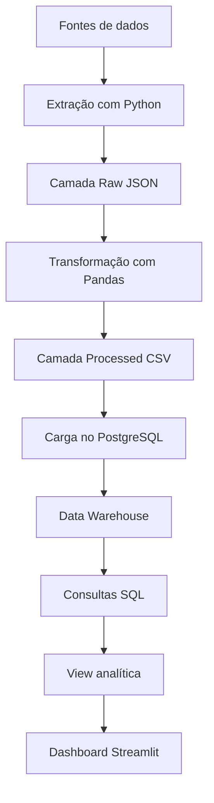

# Relatório Técnico - Plataforma de Inteligência para Concursos Públicos

## Sumário
- [Visão geral](#visão-geral)
- [Problema de negócio](#problema-de-negócio)
- [Objetivos](#objetivos)
- [Tecnologias utilizadas](#tecnologias-utilizadas)
- [Arquitetura da solução](#arquitetura-da-solução)
- [Estrutura do projeto](#estrutura-do-projeto)
- [Ambiente Docker](#ambiente-docker)
- [Modelo de dados](#modelo-de-dados)
- [Data Warehouse](#data-warehouse)
- [Pipeline ETL](#pipeline-etl)
- [Consultas analíticas SQL](#consultas-analíticas-sql)
- [Dashboard analítico](#dashboard-analítico)
- [Execução do projeto](#execução-do-projeto)
- [Evidências do projeto](#evidências-do-projeto)
- [Etapas concluídas](#etapas-concluídas)
- [Competências demonstradas](#competências-demonstradas)
- [Próximas melhorias](#próximas-melhorias)
- [Considerações finais](#considerações-finais)

## Visão geral

A Plataforma de Inteligência para Concursos Públicos é um projeto de Engenharia de Dados desenvolvido para simular uma solução completa de coleta, tratamento, armazenamento, análise e visualização de dados de concursos públicos.

O foco principal está em concursos voltados para:

- Tecnologia da Informação
- Ciência de Dados
- Engenharia de Dados
- Análise de Dados
- Desenvolvimento de Sistemas
- Áreas correlatas de tecnologia no setor público

O objetivo é centralizar informações dispersas em um Data Warehouse e viabilizar análises sobre bancas, órgãos, cargos, estados, salários, vagas e evolução temporal.

### Resumo executivo

| Item | Descrição |
|---|---|
| Nome do projeto | Plataforma de Inteligência para Concursos Públicos |
| Categoria | Engenharia de Dados |
| Status | Versão 1.0 concluída |
| Banco de dados | PostgreSQL |
| Ambiente | Docker |
| Linguagem principal | Python |
| Processamento | Pandas |
| Conexão com banco | SQLAlchemy |
| Visualização | Streamlit e Plotly |
| Modelagem | Esquema estrela |
| Entrega final | ETL completo + Data Warehouse + SQL Analytics + Dashboard |

## Problema de negócio

As informações sobre concursos públicos estão distribuídas em diversas fontes, como:

- Sites de bancas organizadoras
- Portais institucionais
- Portais de notícias
- Editais em PDF
- Diários oficiais
- Agregadores de concursos

Essa dispersão dificulta análises consolidadas, comparação salarial, identificação de bancas recorrentes e acompanhamento regional das oportunidades.

### Dores identificadas

| Dor | Impacto |
|---|---|
| Dados espalhados em várias fontes | Dificulta análise consolidada |
| Informações em formatos diferentes | Exige tratamento manual |
| Falta de visão histórica | Dificulta análise de tendências |
| Comparação salarial manual | Processo lento e sujeito a erros |
| Ausência de visão por banca | Dificulta direcionamento de estudos |
| Falta de dashboard centralizado | Reduz capacidade de tomada de decisão |

### Perguntas analíticas

| Pergunta analítica | Valor gerado |
|---|---|
| Quais bancas mais organizam concursos de TI? | Apoio ao planejamento de estudos |
| Quais estados possuem os melhores salários? | Comparação de oportunidades |
| Quais cargos aparecem com maior frequência? | Identificação de tendências |
| Quais órgãos mais ofertam vagas de tecnologia? | Priorização de concursos |
| Como os salários evoluem ao longo dos anos? | Análise histórica |
| Quais concursos possuem maior quantidade de vagas? | Priorização estratégica |
| Quais concursos apresentam maiores salários? | Apoio à tomada de decisão |
| Quais regiões concentram mais oportunidades? | Análise geográfica |

## Objetivos

### Objetivo geral

Construir uma solução de Engenharia de Dados capaz de centralizar informações de concursos públicos em um Data Warehouse, permitindo consultas analíticas e visualização dos dados em um dashboard interativo.

### Objetivos específicos

- Criar uma arquitetura local utilizando Docker.
- Configurar PostgreSQL e pgAdmin.
- Criar um modelo dimensional em esquema estrela.
- Implementar pipeline de extração de dados.
- Armazenar dados brutos em formato JSON.
- Implementar pipeline de transformação com Pandas.
- Gerar dados tratados em formato CSV.
- Implementar pipeline de carga no PostgreSQL.
- Popular tabelas dimensão e tabela fato.
- Criar consultas SQL analíticas.
- Criar uma view consolidada para consumo analítico.
- Criar dashboard interativo com Streamlit e Plotly.
- Documentar o projeto de forma profissional para GitHub.

## Tecnologias utilizadas

| Tecnologia | Finalidade |
|---|---|
| Python | Desenvolvimento dos pipelines ETL |
| Pandas | Tratamento, limpeza e padronização dos dados |
| PostgreSQL | Banco de dados relacional e analítico |
| Docker | Criação de ambiente local reprodutível |
| Docker Compose | Orquestração dos containers |
| SQL | Criação de tabelas, consultas e views |
| SQLAlchemy | Integração entre Python e PostgreSQL |
| psycopg2 | Driver PostgreSQL para Python |
| python-dotenv | Leitura de variáveis de ambiente |
| pgAdmin | Administração visual do banco |
| Streamlit | Criação do dashboard web |
| Plotly | Visualizações interativas |
| Git | Versionamento do código |
| GitHub | Publicação do projeto como portfólio |

## Arquitetura da solução

A arquitetura foi projetada para representar um fluxo real de Engenharia de Dados, partindo da ingestão dos dados até a entrega visual para análise.



### Camadas da arquitetura

| Camada | Descrição | Status |
|---|---|---|
| Fontes de dados | Dados simulados de concursos públicos | Concluído |
| Extração | Geração dos dados brutos em JSON | Concluído |
| Raw | Armazenamento dos dados sem tratamento | Concluído |
| Transformação | Limpeza, padronização e enriquecimento | Concluído |
| Processed | Dados tratados em CSV | Concluído |
| Carga | Inserção dos dados no PostgreSQL | Concluído |
| Data Warehouse | Modelo estrela com fato e dimensões | Concluído |
| SQL Analytics | Consultas analíticas organizadas | Concluído |
| View analítica | Consolidação para BI e dashboard | Concluído |
| Dashboard | Visualização interativa dos indicadores | Concluído |

## Estrutura do projeto

```text
plataforma-inteligencia-concursos/
├── dashboard/
│   ├── app.py
│   ├── dashboard_home.png
│   ├── dashboard_filtros.png
│   ├── dashboard_graficos.png
│   └── dashboard_graficos2.png
├── data/
│   ├── raw/
│   ├── processed/
│   ├── warehouse/
│   └── sample/
├── docs/
│   └── relatorio.md
├── notebooks/
├── src/
│   ├── extraction/
│   ├── transformation/
│   ├── loading/
│   └── database/
├── sql/
│   └── analytics/
├── docker-compose.yml
├── .env.example
├── .gitignore
├── README.md
└── requirements.txt
```

### Descrição das pastas

| Pasta | Finalidade |
|---|---|
| `dashboard` | Aplicação Streamlit do dashboard |
| `data/raw` | Dados brutos gerados pelo pipeline de extração |
| `data/processed` | Dados tratados gerados pelo pipeline de transformação |
| `data/warehouse` | Camada reservada para dados analíticos finais |
| `data/sample` | Amostras versionáveis para demonstração no GitHub |
| `docs` | Documentação técnica do projeto |
| `notebooks` | Análises exploratórias |
| `src/extraction` | Scripts de extração |
| `src/transformation` | Scripts de transformação |
| `src/loading` | Scripts de carga no banco |
| `src/database` | Conexão com PostgreSQL |
| `sql/analytics` | Consultas analíticas e view consolidada |

## Ambiente Docker

O arquivo `docker-compose.yml` define a infraestrutura local do projeto.

### Serviços principais

| Serviço | Função |
|---|---|
| PostgreSQL | Armazenamento do Data Warehouse |
| pgAdmin | Interface visual de administração |

### Credenciais de desenvolvimento

| Item | Valor |
|---|---|
| Banco | `concursos_dw` |
| Usuário | `concursos_user` |
| Senha | `concursos_pass` |
| Host | `localhost` |
| Porta | `5432` |

## Modelo de dados

O projeto utiliza modelagem dimensional em formato de esquema estrela.

```text
dim_banca   dim_estado   dim_cargo   dim_orgao
     \          |           |           /
      \         |           |          /
              fato_concurso
```

### Tabelas principais

| Tipo | Tabela | Descrição |
|---|---|---|
| Fato | `fato_concurso` | Armazena os eventos principais dos concursos |
| Dimensão | `dim_banca` | Informações das bancas organizadoras |
| Dimensão | `dim_estado` | Informações dos estados e regiões |
| Dimensão | `dim_cargo` | Informações dos cargos, áreas e níveis |
| Dimensão | `dim_orgao` | Informações dos órgãos públicos e esferas administrativas |

### Principais métricas

| Métrica | Descrição |
|---|---|
| `vagas` | Quantidade de vagas ofertadas |
| `salario` | Salário inicial |
| `ano` | Ano do concurso |
| `data_prova` | Data prevista da prova |

## Data Warehouse

O Data Warehouse foi estruturado para suportar consultas analíticas e consolidação dos dados tratados no pipeline.

### Características

| Aspecto | Descrição |
|---|---|
| Modelo | Esquema estrela |
| Granularidade | Um registro por concurso na fato |
| Relações | Chaves estrangeiras para dimensões |
| Consumo | SQL, BI e dashboard analítico |

## Pipeline ETL

O projeto implementa um fluxo completo de Extração, Transformação e Carga.

```text
Extract
  ↓
Transform
  ↓
Load
```

### Extração

| Item | Descrição |
|---|---|
| Arquivo | `src/extraction/extract_sample_data.py` |
| Entrada | Dados simulados de concursos públicos |
| Saída | Arquivos JSON na pasta `data/raw/` |
| Amostra | `data/sample/concursos_sample.json` |

### Transformação

| Item | Descrição |
|---|---|
| Arquivo | `src/transformation/transform_raw_data.py` |
| Entrada | JSON bruto mais recente |
| Saída | CSV tratado na pasta `data/processed/` |
| Amostra | `data/sample/concursos_processed_sample.csv` |

### Transformações realizadas

| Transformação | Descrição |
|---|---|
| Validação de colunas | Confere campos obrigatórios |
| Padronização textual | Remove espaços extras |
| Padronização de cargos | Cria categorias analíticas |
| Padronização de bancas | Normaliza nomes |
| Conversão de tipos | Ajusta números e datas |
| Faixa salarial | Classifica salários |
| Dias de inscrição | Calcula duração do período |
| Data de transformação | Registra execução |

### Carga

| Item | Descrição |
|---|---|
| Arquivo | `src/loading/load_processed_data.py` |
| Entrada | CSV tratado mais recente |
| Saída | Dados carregados no PostgreSQL |
| Destino | Tabelas dimensão e tabela fato |

### Processo de carga

| Etapa | Descrição |
|---|---|
| Leitura do CSV tratado | Busca o arquivo mais recente em `data/processed` |
| Carga nas dimensões | Popula `dim_banca`, `dim_estado`, `dim_cargo` e `dim_orgao` |
| Busca de IDs | Recupera chaves dimensionais |
| Carga na fato | Popula `fato_concurso` |
| Controle de duplicidade | Evita registros repetidos |

## Consultas analíticas SQL

Após a carga dos dados no PostgreSQL, foram criadas consultas SQL para exploração analítica.

### Arquivos SQL

| Arquivo | Objetivo |
|---|---|
| `01_kpis_gerais.sql` | Indicadores gerais do Data Warehouse |
| `02_analise_por_banca.sql` | Análise por banca organizadora |
| `03_analise_por_estado.sql` | Análise por estado e região |
| `04_analise_por_cargo.sql` | Análise por cargo |
| `05_top_salarios.sql` | Concursos com maiores salários |
| `06_evolucao_por_ano.sql` | Evolução anual de concursos, vagas e salários |
| `07_visao_completa_concursos.sql` | Consulta completa com todas as dimensões |
| `08_create_view_concursos_analytics.sql` | Criação da view analítica |
| `09_kpis_view_analytics.sql` | KPIs usando a view analítica |

### KPIs criados

| Indicador | Descrição |
|---|---|
| Total de concursos | Quantidade de concursos carregados |
| Total de vagas | Soma das vagas ofertadas |
| Salário médio | Média salarial dos concursos |
| Menor salário | Menor salário registrado |
| Maior salário | Maior salário registrado |
| Total de bancas | Quantidade de bancas distintas |
| Total de estados | Quantidade de estados distintos |
| Total de cargos | Quantidade de cargos distintos |
| Total de órgãos | Quantidade de órgãos distintos |

### View analítica

Foi criada a view `vw_concursos_analytics`, que consolida a tabela fato com as dimensões.

### Benefícios da view

| Benefício | Descrição |
|---|---|
| Simplificação | Evita repetir joins complexos |
| Reutilização | Serve para consultas, dashboards e BI |
| Organização | Centraliza a visão analítica |
| Performance lógica | Facilita consumo dos dados |
| Integração | Pode ser usada em Power BI, Metabase, Superset ou Streamlit |

## Dashboard analítico

O dashboard foi desenvolvido com Streamlit e Plotly.

| Item | Descrição |
|---|---|
| Arquivo | `dashboard/app.py` |
| Fonte de dados | `vw_concursos_analytics` |
| Framework | Streamlit |
| Visualização | Plotly |
| Banco | PostgreSQL |

### Objetivo do dashboard

Transformar os dados carregados no PostgreSQL em uma interface visual e interativa, permitindo análise rápida dos concursos públicos.

### Funcionalidades implementadas

| Funcionalidade | Descrição |
|---|---|
| KPIs principais | Total de concursos, vagas, média salarial e maior salário |
| Filtros interativos | Estado, banca, ano, nível, área e região |
| Concursos por estado | Gráfico de barras |
| Concursos por banca | Ranking das bancas |
| Concursos por ano | Evolução temporal |
| Vagas por nível | Distribuição por nível |
| Salário médio por estado | Comparação salarial |
| Vagas por região | Distribuição regional |
| Top cargos por vagas | Ranking dos cargos com mais vagas |
| Top salários | Concursos com maiores salários |
| Base completa | Tabela detalhada com os dados analíticos |

### Fluxo final do projeto

```text
Extração
  ↓
Transformação
  ↓
Carga
  ↓
Data Warehouse
  ↓
SQL Analytics
  ↓
Dashboard
```

## Execução do projeto

### 1. Subir os containers

```bash
docker compose up -d
```

### 2. Criar ambiente virtual

```bash
python -m venv .venv
```

Ativar no Git Bash:

```bash
source .venv/Scripts/activate
```

Ativar no PowerShell:

```powershell
.venv\Scripts\Activate.ps1
```

### 3. Instalar dependências

```bash
pip install -r requirements.txt
```

### 4. Executar ETL completo

```bash
python src/extraction/extract_sample_data.py
python src/transformation/transform_raw_data.py
python src/loading/load_processed_data.py
```

### 5. Criar view analítica

```bash
docker exec -i concursos_postgres psql -U concursos_user -d concursos_dw < sql/analytics/08_create_view_concursos_analytics.sql
```

### 6. Executar consulta de KPIs

```bash
docker exec -i concursos_postgres psql -U concursos_user -d concursos_dw < sql/analytics/01_kpis_gerais.sql
```

### 7. Executar dashboard

```bash
streamlit run dashboard/app.py
```

Acesse no navegador:

```text
http://localhost:8501
```

## Evidências do projeto

Para fortalecer o portfólio no GitHub, recomenda-se manter imagens do dashboard na pasta `dashboard/`, por exemplo:

- `dashboard/dashboard_home.png`
- `dashboard/dashboard_filtros.png`
- `dashboard/dashboard_graficos.png`
- `dashboard/dashboard_graficos2.png`

Essas imagens ajudam recrutadores a visualizar rapidamente o resultado final do projeto.

## Etapas concluídas

| Etapa | Status |
|---|---|
| Estrutura inicial do projeto | Concluído |
| Configuração do Docker | Concluído |
| Configuração do PostgreSQL | Concluído |
| Configuração do pgAdmin | Concluído |
| Criação do modelo dimensional | Concluído |
| Criação dos scripts SQL estruturais | Concluído |
| Inserção de dados simulados | Concluído |
| Conexão Python com PostgreSQL | Concluído |
| Pipeline de extração | Concluído |
| Geração de dados brutos em JSON | Concluído |
| Pipeline de transformação | Concluído |
| Geração de dados tratados em CSV | Concluído |
| Pipeline de carga | Concluído |
| Carga nas dimensões | Concluído |
| Carga na tabela fato | Concluído |
| Controle básico de duplicidade | Concluído |
| Consultas analíticas SQL | Concluído |
| Criação da view `vw_concursos_analytics` | Concluído |
| Criação do dashboard Streamlit | Concluído |
| Documentação técnica | Concluído |
| Versão 1.0 para portfólio | Concluído |

## Competências demonstradas

| Competência | Aplicação no projeto |
|---|---|
| Python | Criação dos pipelines |
| Pandas | Transformação dos dados |
| SQL | Consultas analíticas e modelagem |
| PostgreSQL | Data Warehouse |
| Docker | Ambiente reproduzível |
| SQLAlchemy | Integração Python com banco |
| Modelagem dimensional | Esquema estrela |
| ETL | Pipeline completo |
| Data Warehouse | Estrutura analítica |
| Streamlit | Dashboard interativo |
| Plotly | Visualizações |
| Git/GitHub | Versionamento e portfólio |
| Documentação | README e relatório técnico |

## Próximas melhorias

Embora a versão 1.0 esteja concluída, o projeto pode evoluir com melhorias.

| Melhoria | Descrição |
|---|---|
| Coleta real | Buscar dados em sites ou APIs públicas |
| Extração de PDF | Ler editais automaticamente |
| Orquestração | Adicionar Airflow ou Prefect |
| Data Lake com Parquet | Salvar dados em formato otimizado |
| Camada staging | Criar tabelas intermediárias no banco |
| Testes automatizados | Validar pipelines com pytest |
| Qualidade de dados | Adicionar validações e checks |
| Logs estruturados | Monitorar execuções dos pipelines |
| Deploy do dashboard | Publicar a aplicação em ambiente gratuito |
| CI/CD | Automatizar validações no GitHub Actions |

## Considerações finais

A Plataforma de Inteligência para Concursos Públicos atingiu sua primeira versão completa.

O projeto contempla um fluxo de Engenharia de Dados de ponta a ponta:

```text
Coleta
  ↓
Armazenamento bruto
  ↓
Transformação
  ↓
Carga
  ↓
Data Warehouse
  ↓
SQL Analytics
  ↓
Dashboard
```

A solução demonstra domínio prático de ferramentas e conceitos importantes para Engenharia de Dados, como Docker, PostgreSQL, SQL, Python, Pandas, SQLAlchemy, modelagem dimensional, ETL, consultas analíticas e visualização de dados.

Além disso, o projeto foi organizado com foco em portfólio, contendo estrutura clara de pastas, documentação técnica, scripts reutilizáveis e uma entrega visual por meio do dashboard.
