# Public Exam Intelligence Platform

Data Engineering project to collect, transform, store, analyze, and visualize public exam data in a complete pipeline.

The focus is on technology-related openings and adjacent areas, with a portfolio-oriented presentation designed for recruiters: clear technical scope, practical delivery, and analytical value.

<p>
  
  
  
  
  
</p>

## Overview

| Item | Description |
|---|---|
| Area | Data Engineering and Analytics |
| Languages | Python, SQL |
| Main stack | Pandas, PostgreSQL, Streamlit, Plotly, Docker |
| Purpose | ETL pipeline + analytics layer + dashboard |

## At a glance

| Signal | Value |
|---|---|
| Pipeline | Extract -> transform -> load -> analyze -> visualize |
| Data layer | Raw, processed, and warehouse zones |
| Delivery | Dashboard plus reusable SQL analytics |
| Strength | Clear link between data pipeline and business questions |

## Problem this project solves

Public exam information is usually spread across exam boards, institutional portals, news sites, and exam aggregators.

This makes it harder to:

- compare salaries
- analyze by board, role, and state
- track historical trends
- visualize opportunities in one place

## What this project delivers

| Delivery | Result |
|---|---|
| Extraction | Raw JSON generation |
| Transformation | Pandas-based processing and column standardization |
| Loading | PostgreSQL / Data Warehouse insertion |
| Analytics | SQL queries for KPIs and comparisons |
| Visualization | Interactive Streamlit dashboard |

## Project structure

```text
plataforma-inteligencia-concursos/
├── dashboard/
├── data/
│   ├── raw/
│   ├── processed/
│   └── warehouse/
├── datasample/
├── docs/
├── sql/
│   └── analytics/
├── src/
├── .env.example
├── docker-compose.yml
├── README.md
└── requirements.txt
```

## Pipeline

```mermaid
flowchart LR
    A[Data sources] --> B[Extraction with Python]
    B --> C[Raw JSON]
    C --> D[Transformation with Pandas]
    D --> E[Processed CSV]
    E --> F[Load into PostgreSQL]
    F --> G[Data Warehouse]
    G --> H[SQL Queries]
    H --> I[Analytical View]
    I --> J[Streamlit Dashboard]
```



## Technologies used

| Category | Tools |
|---|---|
| Language | Python |
| Data processing | Pandas |
| Database | PostgreSQL |
| Query layer | SQL |
| Integration | SQLAlchemy, psycopg2 |
| Environment | Docker, Docker Compose |
| Environment variables | python-dotenv |
| Interface | Streamlit |
| Visualization | Plotly |

## Analytical model

The project uses dimensional modeling with a star schema.

| Type | Table | Purpose |
|---|---|---|
| Fact | `fato_concurso` | Stores loaded exam records |
| Dimension | `dim_banca` | Exam boards |
| Dimension | `dim_estado` | States and regions |
| Dimension | `dim_cargo` | Roles, areas, and levels |
| Dimension | `dim_orgao` | Public agencies and branches |

## Core metrics

| Metric | Description |
|---|---|
| `vagas` | Number of openings |
| `salario` | Starting salary |
| `ano` | Exam year |
| `data_prova` | Scheduled exam date |

## Dashboard

The dashboard was built with Streamlit and Plotly to enable fast visual analysis of the loaded data.

| Feature | Description |
|---|---|
| Main KPIs | Total exams, openings, average salary, and highest salary |
| Filters | State, board, year, level, area, and region |
| Charts | Distribution by state, board, year, level, and role |
| Analytical table | Detailed data exploration |

### Screenshots

| Screen | Image |
|---|---|
| Home | `dashboard/dashboard_home.png` |
| Filters | `dashboard/dashboard_filtros.png` |
| Charts | `dashboard/dashboard_graficos.png` |
| Additional charts | `dashboard/dashboard_graficos2.png` |

## Analytical queries

SQL queries are stored in `sql/analytics/`.

| File | Purpose |
|---|---|
| `01_kpis_gerais.sql` | General KPIs |
| `02_analise_por_banca.sql` | Analysis by board |
| `03_analise_por_estado.sql` | Analysis by state |
| `04_analise_por_cargo.sql` | Analysis by role |
| `05_top_salarios.sql` | Top salary listings |
| `06_evolucao_por_ano.sql` | Yearly trend analysis |
| `07_visao_completa_concursos.sql` | Full analytical view |
| `08_create_view_concursos_analytics.sql` | Analytical view creation |
| `09_kpis_view_analytics.sql` | KPI queries using the view |

## How to run

### 1. Clone the repository

```bash
git clone URL_OF_THE_REPOSITORY
cd plataforma-inteligencia-concursos
```

### 2. Create the environment

```bash
python -m venv .venv
.venv\Scripts\activate
pip install -r requirements.txt
```

### 3. Configure variables

Copy the example file:

```bash
copy .env.example .env
```

### 4. Run the project

```bash
streamlit run dashboard/app.py
```

## Project strengths

- complete data pipeline
- organized documentation
- business-focused analysis
- presentation-ready dashboard
- strong fit for a professional portfolio

## notes

- The project shows practical data engineering, not only SQL queries.
- The dashboard makes the data story easy to scan quickly.
- The structure highlights pipeline thinking and business value together.

## Next steps

- expand the dataset
- add more regional and agency-level analysis
- evolve the dashboard
- add update automation
